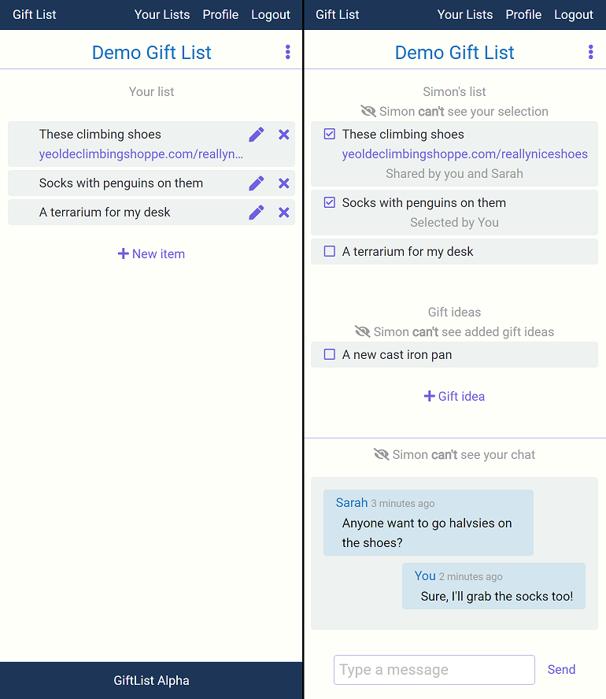
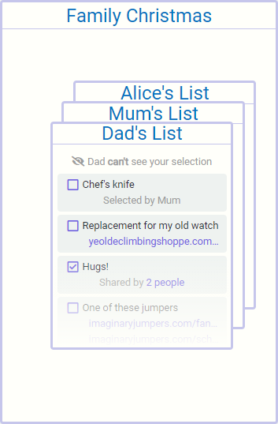
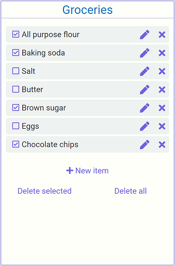

# giftlistback - the back end repo of GiftList

## Gift List Project overview

Gift List is my first attempt to build a full-stack web application. I developed the project all the way from a concept scribbed on paper to something resembling a real product deployed and publically available on the web.

While I attempted to build something genuinely useful, my primary objective was to learn new technologies I was otherwise unfamilar with.

The application is currently deployed to Google Cloud Run and is available at [giftlist.sampsy.dev](https://giftlist.sampsy.dev)

## Implemented technologies and key technical features

Back End:

-   Node
-   Express for the app's API endpoints
-   MongoDB + Mongoose for the primary database & schema
-   Socket.io to enable real-time chat
-   Redis Pub/Sub to allow real-time communication between users connected to different containers
-   Emails via Postmark
-   JWT auth

Front End:

-   React builing all my own components
-   Redux
-   SCSS writing all my own styles
-   Axios + Socket.io to communicate with the back end

Common:

-   Typescript
-   Docker with dev containers optimised for speed rebuilt on file save in seconds using npm scripts. Similar prod containers optimised for size to minimise upload time and storage space.
-   Hosted on Google Cloud Run
-   sampsy.dev registered with Google Domains

## The problem Gift List aims to solve

The app aims to solve a problem I run into seemingly every Christmas and frequently on birthdays in my family and friend groups.

Often people share a wish list of things they’d like to receive and everyone else tries to coordinate who is getting what. But everyone updates each other on what they have purchased in a disorganised way.

You'll receive updates through different mediums - by phone, by text, in person etc. You won't get all the updates so have to chase people. You also have to update everyone else on what you're getting AND you don't want to accidentally spoil any surprises by telling the wrong person.

It can be a bit of an inconvenience at birthdays, but gets really tricky at Christmas when everyone has a list of their own!

## The solution

Gift List provides a single location for individuals to share their wish lists with their friends & family who can coordinate easily without worrying about spoiling any surprises.

### The Lists

Gift List:

A gift list is the core selling point of the app. An individual can share their list with others who can select items from that list, suggest their own ideas, and chat in real time without you being able to see.

What you see vs what your guests see:

Gift Group:

A gift group allows everyone to create their own Gift List without having to send out invites themselves. Great for times when multiple people are writing their own lists, like at Christmas.

Basic List:

I also added a basic todo / shopping list as it was relatively easy to implement. Everyone in the list can add, select, modify and delete all items.

## Setup Guide

See [requirements](documentation/REQUIREMENTS.md)

## Licence

All rights reserved
